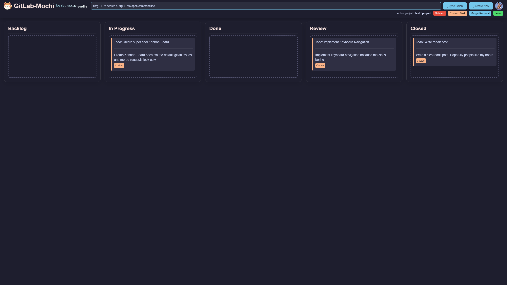
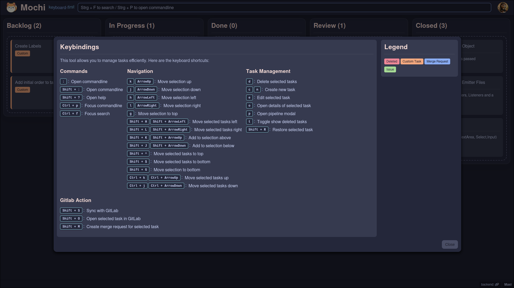

# Mochi - GitLab-Integrated Kanban Board


Mochi is a **keyboard-friendly Kanban-style task management tool** integrated with **GitLab**. Manage your GitLab issues and tasks seamlessly with efficient keyboard-driven commands, modal interactions, and GitLab synchronization.



## Support Me

If you like this project, consider [buying me a coffee](https://www.buymeacoffee.com/maxikriegl)!

<a href="https://www.buymeacoffee.com/maxikriegl" target="_blank">
    
</a>

## Features

- **Kanban-style task management**: Organize tasks into columns representing different states.
- **GitLab integration**: Sync tasks, merge requests, and issues directly with GitLab.
- **Keyboard-driven navigation**: Control the entire app with keyboard shortcuts.
- **Create, edit, and delete tasks** with ease.
- **View and restore deleted tasks**.
- **GitLab issue linking**: Quickly open tasks directly in GitLab.
- **Modal-based interactions**: Smooth and intuitive modals for task management.

---

## Installation

1. Clone the repository:

   ```bash
   git clone https://your-repository-url.git
   cd mochi
   ```

2. Install dependencies:

   ```bash
   bun install
   ```

3. Set up your environment variables in a `.env` file (for GitLab API integration):

   ```bash
   GITLAB_API_URL=https://gitlab.com/api/v4
   GITLAB_ACCESS_TOKEN=your_personal_access_token
   ```

4. Start the development server:

   ```bash
   npm start
   ```

---

## Usage

### Kanban Interface

The Mochi app presents tasks in a Kanban-style layout where tasks are organized in columns. Each column represents a specific task state (e.g., To Do, In Progress, Done).

### Keyboard Navigation

Mochi is designed to be navigated entirely by keyboard, making task management fast and efficient.

### Task Synchronization

Mochi syncs your tasks, merge requests, and issues directly with GitLab. You can create tasks, sync with GitLab, and even open tasks in GitLab with a single key press.

---

## Keyboard Shortcuts

Here are the keybindings for controlling Mochi:



| Key Combination             | Action                                      |
| --------------------------- | ------------------------------------------- |
| `W / ↑`                     | Move up through tasks                       |
| `S / ↓`                     | Move down through tasks                     |
| `A / ←`                     | Switch to the previous column               |
| `D / →`                     | Switch to the next column                   |
| `N / Shift + → / Shift + D` | Move selected task to the next state        |
| `P / Shift + ← / Shift + A` | Move selected task to the previous state    |
| `C`                         | Create a new task                           |
| `E`                         | Edit selected task                          |
| `X`                         | Delete selected task                        |
| `V`                         | Toggle view of deleted tasks                |
| `Shift + R`                 | Restore selected task                       |
| `Shift + F / Ctrl + P`      | Search tasks                                |
| `Shift + M`                 | Create merge request from the selected task |
| `Shift + O`                 | Open selected task in GitLab                |
| `Spacebar`                  | Toggle visibility of resolved comments      |
| `Escape`                    | Close all open modals                       |
| `Shift + S`                 | Sync merge requests from GitLab             |
| `H`                         | Open the help modal                         |

---

## Syncing with GitLab

To sync with GitLab, ensure your **GitLab Personal Access Token** is set in the environment file. Use the keyboard shortcuts `Shift + S` to sync merge requests and `Shift + O` to open a selected task in GitLab.

```env
GITLAB_API_URL=https://gitlab.com/api/v4
GITLAB_ACCESS_TOKEN=your_personal_access_token
```

## Development

### Prerequisites

- **Node.js** and **bun**

### Running the app locally

1. Clone the repository

```bash
git clone https://github.com/Coding0tter/GIT-Mochi.git
cd GIT-Mochi
```

2. Start the app

```
docker-compose up --build
```

## Contribution

## License

This project is licensed under the MIT License. See the [LICENSE](https://github.com/Coding0tter/GIT-Mochi/blob/main/LICENSE.md) file for more details.
