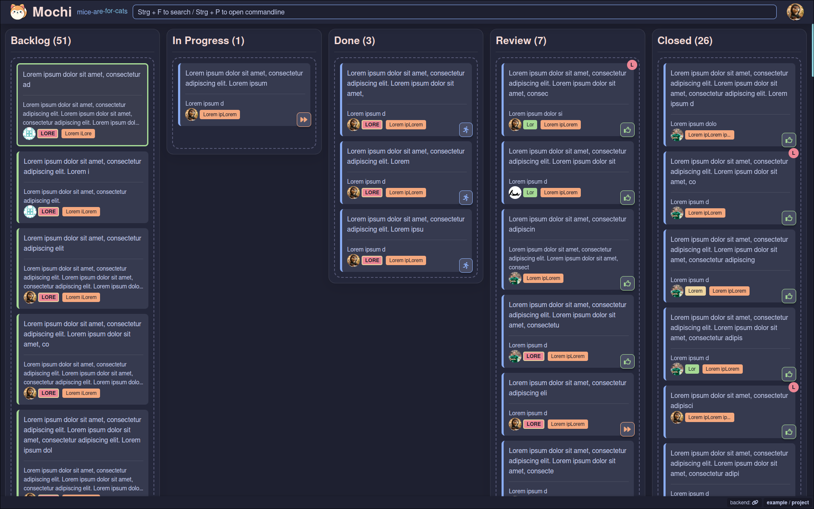

# Mochi - GitLab-Integrated Kanban Board


Mochi is a **keyboard-friendly, GitLab-integrated Kanban board** that makes task management efficient and intuitive. Organize your GitLab issues, handle tasks via keyboard shortcuts, and keep everything in sync with GitLab—all in one place.



## Features

- **Kanban**: Sort tasks by state and track progress visually.
- **GitLab Integration**: Sync tasks, issues, merge requests, comments and more.
- **Keyboard-Driven**: Navigate, move tasks, and open details without a mouse.
- **Pipeline Status at a Glance**: Keep up with CI/CD progress easily.

## Prerequisites

- **Node.js**
- **docker**

## Installation

1. **Clone the repository**:

   ```bash
   git clone https://github.com/Coding0tter/GIT-Mochi.git
   cd mochi
   ```

2. **Configure environment variables** with the interactive setup:

   ```bash
   ./scripts/setup.sh
   ```

Permissions for Personal Access Token:

- api
- read_api
- read_user

3. **Start Mochi**:

   ```bash
   docker-compose up -d
   ```

4. **Select your first project**

- Mochi will start at http://localhost:3005
- open the kanban view with `Ctrl + 1`
- open the commandline with `:` or `Ctrl + p`
- choose `listProjects` and select your project

## Keyboard Shortcuts


Open the help modal with `?`

## GitLab Syncing

Make sure your **[GitLab Personal Access Token](https://docs.github.com/en/authentication/keeping-your-account-and-data-secure/managing-your-personal-access-tokens)** is set in the `.env` file before syncing. Use `Shift + S` for syncing manually. Git-Mochi syncs data every 5 minutes automatically

## Support the Project

If you find Mochi helpful, please consider [buying me a coffee](https://www.buymeacoffee.com/maxikriegl)!

[](https://www.buymeacoffee.com/maxikriegl)

## License

Mochi is released under the [MIT License](https://github.com/Coding0tter/GIT-Mochi/blob/main/LICENSE.md).
